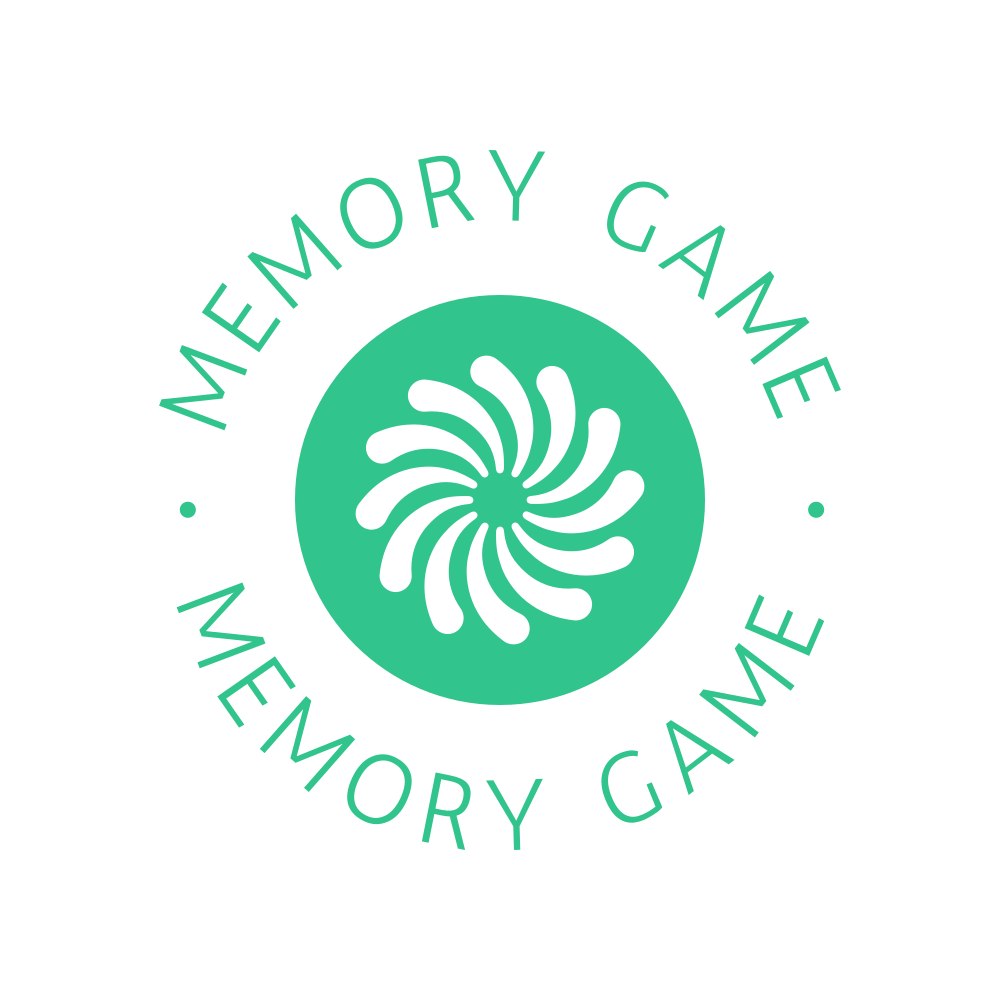
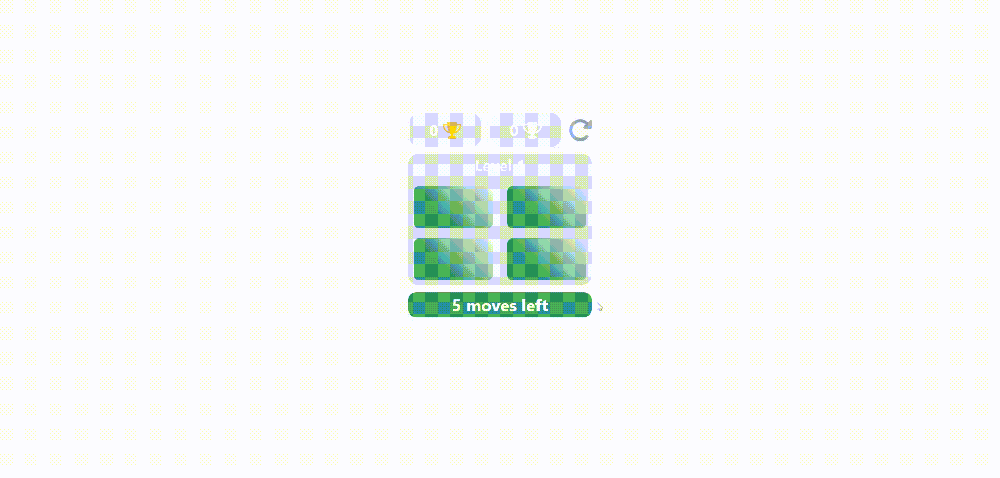

# Memory Game



## Table of Contents

- [About](#about)
- [Demo](#demo)
- [Features](#features)
- [Getting Started](#getting-started)
- [How to Play](#how-to-play)

## About

The Memory Game is a classic concentration game where players must match pairs of cards with identical symbols. It's a fun and challenging way to test your memory skills. This project is a digital version of the game built using CSS, Chakra UI and React.js .

## Demo

You can play the Memory Game by visiting [this live demo]( https://mazenhesham17.github.io/memory-game/ ).



## Features

- Beautifully designed user interface.
- Different difficulty levels to challenge your memory.
- Score counter to keep track of your progress.

## Getting Started

To get a copy of the Memory Game up and running on your local machine, follow these steps:

1. Clone the repository:

   ```bash
   git clone https://github.com/mazenhesham17/memory-game.git

2. Install Dependencies:
 
   ```bash
   npm install

3. Run:

   ```bash
   npm run
   
## How to Play

- Click on a card to reveal its symbol.
- Click on a second card to see if it matches the first one.
- Match all the cards in the shortest time and with the fewest moves to win the game.
- Enjoy the game and test your memory skills!


